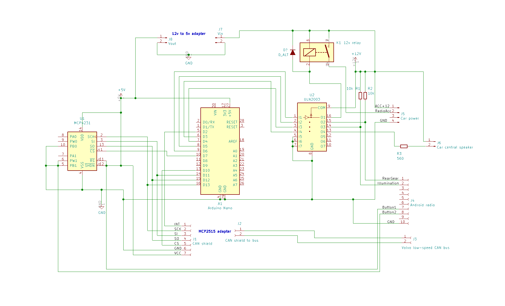

# Volvo low-speed CAN bus adapter

  Some time ago I had installed the Android radio into my Volvo XC90 and had removed the all useless modules (phone, CD-changer, audio module, amplifier, navigation, antenna).
I think the car lost weight :)
I have got all nice android stuff, bluetooth connection to phone, video-in for the video recorder, sub-woofer out and etc.
But I have lost the parking assistant(it works through Volvo audio system), steering wheel buttons.
 So I have decided to make my own CAN bus adapter.

## Features:

* All information is received by low-speed car CAN bus, adapter works in Listen Only mode
* Audio and navigation steering wheel buttons are mapped to two digital rheostats (sit to first, and six to second). It's simulated resistive buttons for Android audio
* Rear gear output (0/12v)
* Low ambient light detector output (0/12v)
* Ignition key position I/II output (relay)
* Parking assistant buzzer simulation (I've used central speaker)
* Parking assistant control button allows to enable/disable parking buzzer

## Hardware

* Arduino Nano
* MCP2515 based CAN bus adapter
* MCP4231 double digital potentiometer
* ULN2003A for digital outputs
* 12v relay

## Schematic

* [PDF file](doc/schematic.pdf)

## Software

 Libraries:
* [Tone] (https://github.com/daniel-centore/arduino-tone-library) 
* [MCP4231] (https://github.com/jmalloc/arduino-mcp4xxx)
* [MCP2515] (https://github.com/autowp/arduino-mcp2515) Has some changes, see forked version

 Forked libraries:
* [Tone] (https://github.com/olegel/arduino-tone-library)
* [MCP4231] (https://github.com/olegel/arduino-mcp4xxx)
* [MCP2515] (https://github.com/olegel/arduino-mcp2515)

## Compilation
I've used Visual Studio Code with Platformio extension.
Clone code, update sub-modules.
Open volvo.code-workspace file, build and upload.

## My module:

## Enjoy!